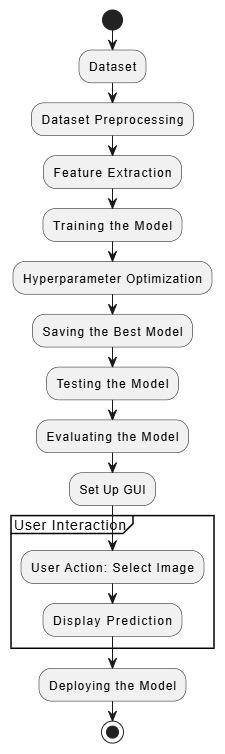
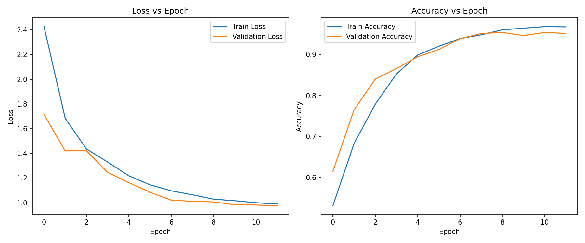

# 🍎 Shelf Life Prediction of Fruits & Vegetables Using Deep Learning

> **Capstone Project** · VIT-AP University · Dec 2024  
> **Team:** Satyala Murali Karthik · **Mekala Samuel** · Yelakanti Ramu  
> **Guide:** Dr. S. Kalyani · School of Electronics Engineering  
> **Repository:** [github.com/samuel-mekala/shelf-life-prediction](https://github.com/samuel-mekala/shelf-life-prediction)

[](https://python.org)
[](https://pytorch.org)
[](https://streamlit.io)
[](/.github/workflows/ci.yml)

---

## 📌 Overview

Food wastage is a critical global challenge, particularly for perishable produce. This project presents a **deep learning-based image classification and shelf-life estimation system** using a fine-tuned **ShuffleNet V2** architecture. The system categorizes fruits and vegetables into freshness levels ("Fresh" vs. "Rotten"), estimates the remaining shelf life in days for fresh items, and reports high-precision confidence scores.

The solution outperforms standard benchmark models like ResNet-18, MobileNetV2, EfficientNet-B0, and DenseNet-121 while remaining lightweight enough for **edge device deployment** and **cloud hosting**.

---

## 🏗️ System Architecture & Workflow



```
Produce Image Input (Upload / Camera)
               │
               ▼
┌──────────────────────────────────────────────┐
│            Image Preprocessing               │
│  • Resize → 256×256                          │
│  • CenterCrop → 224×224                      │
│  • Normalize (ImageNet Mean & Std)           │
│  • Split: 70% Train / 15% Val / 15% Test     │
└──────────────────────┬───────────────────────┘
                       │
                       ▼
┌──────────────────────────────────────────────┐
│           ShuffleNet V2 Model                │
│  • Pre-trained ImageNet Feature Extractor    │
│  • Regularized FC Classifier (Dropout p=0.5) │
│  • Optimization: Adam (lr=0.003), StepLR     │
└──────────────────────┬───────────────────────┘
                       │
                       ▼
    Fresh / Rotten Classification
  + Confidence Percentage (%)
  + Estimated Remaining Shelf Life (Days)
```

---

## 🏆 Benchmark Evaluation & Results

### Final Metrics on Test Dataset
| Metric | Score | Performance Highlights |
|---|---|---|
| **Accuracy** | **97.25%** | Highest classification accuracy |
| **F1 Score** | **96.80%** | Balanced precision & recall |
| **ROC AUC** | **97.10%** | Exceptional class discrimination |
| **Precision-Recall AUC** | **95.85%** | Robust across confidence thresholds |

### SOTA Model Comparison
| Model | Accuracy (%) | F1 Score (%) | Remarks |
|---|---|---|---|
| **ShuffleNet V2 (Ours)** | **97.25%** | **96.80%** | **Superior accuracy + lowest compute cost ✅** |
| MobileNetV2 | 96.40% | 95.85% | Lightweight, close runner-up |
| EfficientNet-B0 | 95.75% | 95.25% | Good balance of accuracy and speed |
| DenseNet-121 | 95.10% | 94.60% | Slightly slower computation |
| ResNet-18 | 94.85% | 94.10% | Reliable but computationally heavier |



---

## 💻 Interfaces

### 🌐 1. Streamlit Web Interface (`web_app.py`)
A interactive web portal for live browser-based shelf-life prediction, produce category selection, and dynamic metric visualizations.

- **Drag-and-Drop Image Upload**
- **Interactive Freshness Meter & Shelf Life Days Badge**
- **SOTA Comparison & Metric Analytics Tab**

```bash
# Launch Streamlit Web App locally
streamlit run web_app.py
```

### 🖥️ 2. Desktop Tkinter Interface (`app.py`)
A desktop GUI matching the capstone project report specifications:
```bash
# Launch Tkinter Desktop App
python app.py
```

Output format as specified in report:
`Predicted: Tomato (10-15) days of shelf life left (72.83% confidence)`

---

## 🚀 How to Run Locally

```bash
# 1. Clone the repository
git clone https://github.com/samuel-mekala/shelf-life-prediction.git
cd shelf-life-prediction

# 2. Install dependencies
pip install -r requirements.txt

# 3. (Optional) Train the ShuffleNet V2 Model
# Place dataset in data/shelf_life/Fresh and data/shelf_life/Rotten
python train.py

# 4. Launch the Web App
streamlit run web_app.py

# 5. Or launch the Desktop App
python app.py
```

---

## 🌐 Deploying to the Web (Live Hosting)

### Deploying to Streamlit Community Cloud (Free & Instant)
1. Go to [share.streamlit.io](https://share.streamlit.io) and log in with your GitHub account (`samuel-mekala`).
2. Click **New app**.
3. Select Repository: `samuel-mekala/shelf-life-prediction`.
4. Main file path: `web_app.py`.
5. Click **Deploy!** Your app will be live on a custom URL (e.g., `https://shelf-life-prediction.streamlit.app`).

---

## 🛠️ Tech Stack

- **Deep Learning Framework:** PyTorch & torchvision
- **Model Architecture:** ShuffleNet V2 (`shufflenet_v2_x1_0`)
- **Evaluation & Metrics:** scikit-learn & matplotlib
- **Web Interface:** Streamlit
- **Desktop Interface:** Tkinter
- **Version Control & CI:** Git & GitHub Actions

---

*VIT-AP University · Capstone Project Report · School of Electronics Engineering · Dec 2024*
